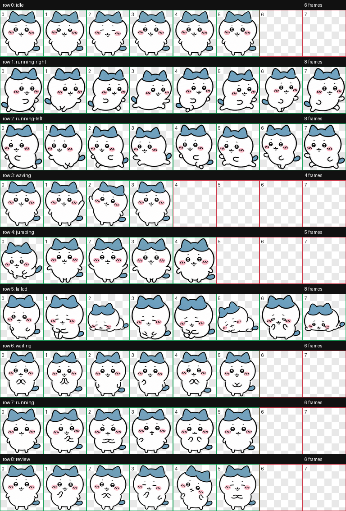

# Hachiware Codex Pet

Fan-made Hachiware-style desktop pet for Codex.

This repository contains a ready-to-install custom pet package:

- `pet.json`
- `spritesheet.webp`
- preview and QA files under `preview/` and `qa/`



## Install

### Windows

Run PowerShell from this repository:

```powershell
.\install.ps1
```

Or copy manually:

```powershell
$dest = Join-Path $HOME ".codex\pets\hachiware"
New-Item -ItemType Directory -Force -Path $dest
Copy-Item .\pet.json $dest -Force
Copy-Item .\spritesheet.webp $dest -Force
```

Restart Codex after copying if the pet does not appear immediately.

### macOS / Linux

```bash
./install.sh
```

Or copy manually:

```bash
mkdir -p "$HOME/.codex/pets/hachiware"
cp pet.json spritesheet.webp "$HOME/.codex/pets/hachiware/"
```

## Validation

The generated sprite atlas was checked against the Codex pet contract:

- Atlas size: `1536x1872`
- Grid: `8` columns x `9` rows
- Cell size: `192x208`
- Format: WebP with RGBA alpha
- Transparent RGB residue: `0`
- Visual QA: passed after chroma-edge cleanup

See:

- `qa/validation.json`
- `qa/installed-validation.json`
- `qa/review.json`
- `qa/run-summary.json`

## 中文说明

这是一个非官方同人小八风格 Codex 桌宠包。下载后把 `pet.json` 和 `spritesheet.webp` 放到：

```text
%USERPROFILE%\.codex\pets\hachiware
```

如果 Codex 没有立刻显示，重启 Codex 再看自定义桌宠列表。

## Rights Notice

This is an unofficial fan-made asset. It is not affiliated with, endorsed by, or sponsored by the official Chiikawa / Hachiware rights holders.

Do not sell this asset, use it commercially, claim it as official, or use it in a way that confuses people about its origin. See `NOTICE.md`.
